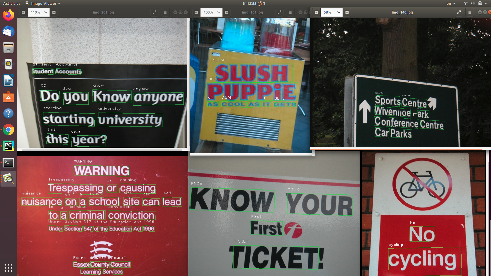

# End-to-end Scene Text Spotting


### Prerequisites

This project using [Pytorch](https://pytorch.org/) - An open source machine learning framework

### Installing


Download the project

```
git clone https://github.com/ishin-pie/e2e-scene-text-spotting.git
```

Installing from requirements.txt file 

```
cd e2e-scene-text-spotting

pip install -r requirements.txt
```

Note: we suggest you to install on the python virtual environment <br />
Learn more: [Installing Deep Learning Frameworks on Ubuntu with CUDA support](https://www.learnopencv.com/installing-deep-learning-frameworks-on-ubuntu-with-cuda-support/)


## Running Demo

Running the demo of our pre-trained [model](https://drive.google.com/file/d/1toEqT1LA-0ieY0ZFeKc6UWJOVvPXDtF1/view?usp=sharing)

```
python demo.py -m=model_best.pth.tar
```

## Dataset Structure

During training, we use [ICDAR 2015](https://rrc.cvc.uab.es/?ch=4&com=downloads) Traning Set and [ICDAR 2017](https://rrc.cvc.uab.es/?ch=8&com=downloads) Training Set (Latin only). In addition, we use [ICDAR 2015](https://rrc.cvc.uab.es/?ch=4&com=downloads) Test Set for validating our model.<br /><br />

The dataset should structure as follows:

```
[dataset root directory]
├── train_images
│   ├── img_1.jpg
│   ├── img_2.jpg
│   └── ...
├── train_gts
│   ├── gt_img_1.txt
│   ├── gt_img_2.txt
│   └── ...
└── test_images
    ├── img_1.jpg
    ├── img_2.jpg
    └── ...
```
Note: the [dataset root directory] should be placed in "config.json" file. <br /><br />
Sample of ground truth format:
```
x1,y1,x2,y2,x3,y3,x4,y4,script,transcription
```


## Training

Training the model by yourself
```
python train.py
```
Note: check the "config.json" file, which is used to adjust the training configuration.<br /><br />

Experiment on GEFORCE RTX 2070

## Examples



## Acknowledgments

* https://github.com/argman/EAST
* https://github.com/jiangxiluning/FOTS.PyTorch

